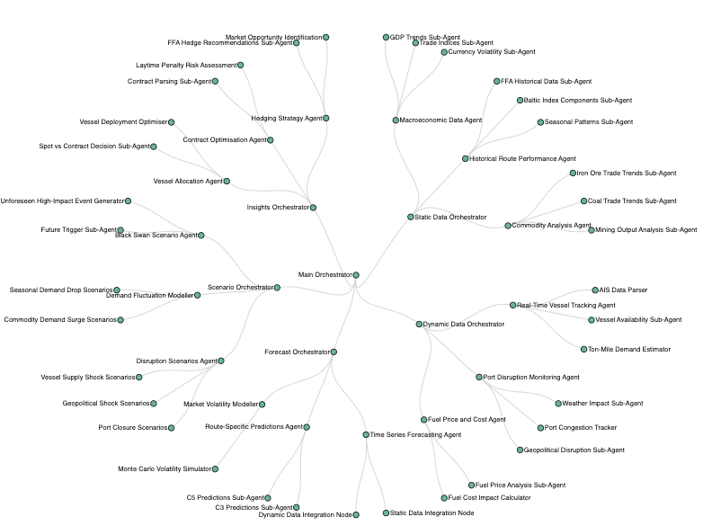

# MarineSense

MarineSense is a forecasting engine tailored to the maritime freight markets. By blending long-term 
macroeconomic insights with real-time operational signals, it provides a flexible, data-driven framework for 
anticipating both gradual shifts and sudden disruptions. Beyond standard forecasting, it supports scenario 
planning—including "black swan" events and integrates user / S.M.E feedback to continuously refine its models and 
predictions allowing personalised view of market and physical conditions given their views of the environment and future 
beliefs.

## Overview

Maritime trade is influenced by both steady macroeconomic factors and sudden disruptions. Long-term elements such as 
changes in sentiment, exchange rates, regulations, and economic growth trajectories influence the broad contours of 
global trade, while unexpected shifts can quickly alter established routes. 

For example, if India significantly increases its imports of construction materials, it may divert vessel traffic away 
from lanes previously dominated by China. This redirection affects vessel positioning, backhaul routes, and voyage 
timings, ultimately impacting freight rates and operational strategies. 
Though actual outcomes depend on real market data and route logistics, this scenario illustrates how demand shifts can
reshape maritime dynamics. Recognising these changes early allows more informed decisions before the market fully 
responds.

These macro-level trends affect all commodities and trade routes, guiding strategic decisions over extended horizons.
On the other hand, maritime markets face sporadic shocks that can instantly alter supply-demand balances. Port closures,
weather disruptions, and geopolitical tensions can reshape vessel availability, voyage durations, and spot rates 
overnight. 

These disruptions ripple through the value chain, affecting everything from short-term earnings on freight contracts to 
the viability of long-term hedging strategies.

In addition to these external factors, maritime-specific metrics further complicate forecasting. Ton-mile demand, vessel
age profiles, dry bulk cargo mix, and average voyage times all influence the timing and cost of shipping operations. 
Meanwhile, shipping companies often hold long-term contracts, providing strategic leverage in capitalising on market 
imbalances. For instance, a bulk carrier halfway through fulfilling a yearly contract for bauxite shipments can adjust 
its strategy if unexpected route blockages or commodity demand spikes occur mid-year.

MarineSense addresses these challenges by integrating layers of static and dynamic data, scenario modelling, and user 
input within a multi-agent framework. This approach yields coherent forecasts that adapt to unforeseen disruptions, 
leverage proprietary data for competitive advantage, and reflect granular maritime operational details. In doing so, 
MarineSense enables informed decision-making, strategic positioning, and opportunistic plays in a highly variable global 
marketplace.

MarineSense addresses these challenges through:

1. **Hierarchical Graph Structure:**  
   Organises agents and sub-agents into orchestrators that manage data collection, forecasting, scenario generation, and downstream insights.

2. **Static vs. Dynamic Data Layers:**  
   **Static Data** layers aggregate long-term indicators—macro trends, historical route performance, commodity trade patterns.  
   **Dynamic Data** layers focus on real-time or frequently updated data—AIS vessel tracking, port congestion, and fuel prices.

3. **Scenario Planning:**  
   Multiple scenario agents model potential disruptions. Notably, a dedicated Black Swan Scenario Agent introduces rare, unforeseen, high-impact events at a specified forecast horizon (N steps into the future).

4. **User Feedback Loops:**  
   Users can interact with intermediate outputs, provide corrections, or highlight known future events. This feedback improves relevance, quality, and adaptability of forecasts.

5. **Maritime-Specific Nuances:**  
   Maritime pricing complexity (e.g., FFA rates, Baltic Index components), commodity-specific demand patterns, and seasonal route dynamics are incorporated through specialised sub-agents.

## Architecture

The system comprises several orchestrators, each responsible for a domain of the forecasting pipeline:

- **Main Orchestrator (O1):**  
  The top-level coordinator, linking static, dynamic, forecasting, scenario, and insights components.

- **Static Data Orchestrator (O2):**  
  Handles macroeconomic data, historical performance, and commodity analyses.  
  - **Macroeconomic Data Agent:** GDP trends, trade indices, currency volatility.  
  - **Historical Route Performance Agent:** FFA history, Baltic indices, seasonal patterns.  
  - **Commodity Analysis Agent:** Iron ore and coal trends, mining output schedules.

- **Dynamic Data Orchestrator (O3):**  
  Processes real-time inputs.  
  - **Real-Time Vessel Tracking Agent:** AIS data parsing, vessel availability, ton-mile demand.  
  - **Port Disruption Monitoring Agent:** Weather impacts, congestion, geopolitical risks.  
  - **Fuel Price and Cost Agent:** Fuel prices, cost calculators.

- **Forecast Orchestrator (O4):**  
  Integrates static and dynamic insights into actionable forecasts.  
  - **Time Series Forecasting Agent:** Combines data for route-level predictions.  
  - **Route-Specific Predictions Agent:** Specialised forecasts for key routes (C3, C5).  
  - **Market Volatility Modeller:** Monte Carlo simulations for rate fluctuation scenarios.

- **Scenario Orchestrator (O5):**  
  Models what-if and disruption scenarios.  
  - **Disruption Scenarios Agent:** Port closures, geopolitical shocks, vessel supply issues.  
  - **Demand Fluctuation Modeller:** Commodity demand surges or seasonal drops.  
  - **Black Swan Scenario Agent:** Introduces unforeseeable, high-impact events at a future forecast step (N), altering downstream logic and forcing a re-evaluation of previously stable assumptions.

- **Insights Orchestrator (O6):**  
  Turns forecasts and scenarios into operational strategies.  
  - **Vessel Allocation Agent:** Spot vs contract decisions, optimal vessel deployment.  
  - **Contract Optimisation Agent:** Parses contracts, assesses laytime penalties, identifies risks.  
  - **Hedging Strategy Agent:** Suggests FFA hedge recommendations, identifies market opportunities.

This ends up looking something like:

## Introducing the Black Swan Scenario

At a chosen future horizon (N steps ahead), the Black Swan Scenario Agent triggers conditions that represent a drastically different world than previously assumed. For example, it may simulate a critical infrastructure failure or an unprecedented regulatory disruption. The system then:

1. Adjusts dynamic data assumptions: Vessel tracking, port disruptions, and fuel costs are re-evaluated under extreme conditions.
2. Forces the forecast agents to incorporate sudden breaks in historical patterns.
3. Guides the insights layer to rapidly develop contingency plans, hedging strategies, and revised vessel allocation schemes.

This capability ensures that MarineSense is not only robust against known historical patterns but is also equipped to reason about and adapt to events outside normal distributions.

## User Feedback Integration

The User Interaction Layer allows domain experts to review intermediate results and provide corrections. This feedback can loop back into static or dynamic agents, influence scenario settings, or refine forecasting assumptions. Over time, feedback helps the model learn preferences, correct biases, and enhance accuracy.

## Potential Enhancements

- **Error Checking and Confidence Propagation:** Introduce Bayesian methods to propagate uncertainties and confidence intervals through the DAG, reducing the impact of upstream errors.
- **Scenario Diversity:** Extend scenario coverage to seasonal route competitions, currency shocks, and route-specific commodity shifts.

MarineSense provides a flexible, maritime-focused forecasting ontology. It marries static macro-trends with dynamic real-time signals, overlays scenario analysis—including rare black swan events—and transforms these inputs into actionable maritime insights. By supporting user feedback and clearly delineating static and dynamic layers, MarineSense is designed to evolve with market conditions, delivering more informed, adaptive decision-making tools for maritime stakeholders.
