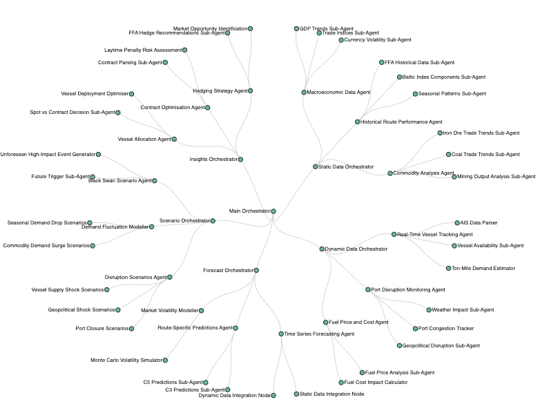

# **MarineSense: Hierarchical Bayesian Forecasting for Maritime Markets**

MarineSense is a flexible and sophisticated forecasting engine tailored for the maritime freight markets. By integrating hierarchical Bayesian methods, term structure modelling, SHAP-based interpretability, and LLM-driven user feedback, it provides actionable insights into gradual market shifts and sudden disruptions. MarineSense transforms static and dynamic data layers into coherent, probabilistic forecasts across routes, regions, and global aggregates.

---

## **Core Features**

### **1. Hierarchical Bayesian Forecasting**
- Multi-level predictions spanning route, regional, and global levels.
- Coherent aggregation and uncertainty propagation across all levels.
- Incorporates expert adjustments with reliability weighting.

### **2. Term Structure Modelling**
- Forward curve modelling for FFA markets across multiple tenors (1M, 3M, 6M, etc.).
- Agnostic to specific models (e.g., Nelson-Siegel, PCA, or hybrid approaches).
- Regime-switching dynamics to capture high- and low-volatility states.

### **3. SHAP-Based Interpretability**
- Feature attribution at every hierarchical level.
- Temporal evolution of feature contributions.
- LLM integration to interpret SHAP values and provide actionable feedback to users.

### **4. Scenario Planning**
- Models potential disruptions, including black swan events.
- Simulates port closures, geopolitical shocks, and demand fluctuations.
- Guides insights for vessel allocation, hedging strategies, and risk mitigation.

### **5. Uncertainty Quantification**
- Comprehensive decomposition of uncertainty: base models, term structures, and expert inputs.
- Regime-dependent variance scaling for credible intervals.
- Risk assessment integrated into scenario analyses.

---

## **System Overview**

MarineSense tackles the complexities of maritime forecasting by combining:

### **Static vs. Dynamic Data Layers**
- **Static Data**: Long-term indicators, including macroeconomic trends, historical route performance, and commodity trade patterns.
- **Dynamic Data**: Real-time updates from AIS vessel tracking, port congestion data, and fuel prices.

### **Scenario Planning Agents**
- **Disruption Scenarios Agent**: Models port closures, geopolitical shocks, and supply-side disruptions.
- **Demand Fluctuation Modeller**: Captures seasonal and market-driven changes in commodity flows.
- **Black Swan Scenario Agent**: Simulates rare, high-impact events to challenge assumptions and stress-test strategies.

### **User Feedback Loops**
- Users interact with SHAP-explained outputs via an LLM interface.
- Real-time feedback refines forecasts, adjusts scenario settings, and improves model assumptions.

The complexities can be seen as something like: 



---

## **Mathematical Framework**

### **Hierarchical Structure**
MarineSense enforces coherence across hierarchical levels:

\[
Y_t = S Y_{t, \text{base}} \\
\text{Where: } \\
Y_t: \text{Aggregated forecasts at time } t. \\
S: \text{Summing matrix mapping base-level forecasts to aggregates.} \\
Y_{t, \text{base}}: \text{Base-level forecasts.}
\]

### **Term Structure Modelling**
Forward curves are modelled using general representations, such as:

\[
f(\tau) = \beta_0 + \beta_1 \frac{1 - e^{-\tau/\lambda_1}}{\tau/\lambda_1} + \beta_2 \left( \frac{1 - e^{-\tau/\lambda_1}}{\tau/\lambda_1} - e^{-\tau/\lambda_1} \right)
\]

Where:
- \( \tau \): Time to maturity (tenor).
- \( \beta \): Term structure parameters.
- \( \lambda \): Decay factor for exponential smoothing.

### **Uncertainty Quantification**
MarineSense integrates uncertainties from various sources:

\[
\Sigma_{\text{total}} = H (H^T \Sigma^{-1} H)^{-1} H^T
\]

Where:
- \( \Sigma = w_1 \Sigma_{\text{base}} + w_2 \Sigma_{\text{term}} + w_3 \Sigma_{\text{expert}} \).
- \( H \): Hierarchical summing matrix.
- \( w_i \): Weights for source-specific uncertainty contributions.

---

## **SHAP Value Integration with LLMs**

### **Feature Attribution and Explanation**
SHAP provides insights into feature contributions at every level:

1. **Base-Level Contributions**:
   \[
   \phi_i = \sum_{S \subseteq N \setminus \{i\}} \frac{|S|! (|N|-|S|-1)!}{|N|!} [f(S \cup \{i\}) - f(S)]
   \]

2. **Hierarchical Propagation**:
   \[
   \phi_{l, i} = H[l, :] \cdot \phi_{\text{base}, i}
   \]

3. **Temporal SHAP Values**:
   \[
   \frac{\partial \phi_i(t)}{\partial t} = g(\phi_i(t), X_t, s_t)
   \]

### **LLM-Driven Interpretations**
- SHAP values are translated into actionable insights using LLMs.
- Users receive plain-language explanations of how features like ton-mile demand, vessel supply, or port disruptions influence predictions.
- Suggestions for corrective actions or adjustments are automatically generated.

---

## **Architecture**

MarineSense organizes its components into orchestrators:

### **Main Orchestrator**
- Coordinates static, dynamic, forecasting, scenario, and insights layers.

### **Static Data Orchestrator**
- **Macroeconomic Data Agent**: Tracks GDP trends, trade indices, and currency volatility.
- **Historical Route Performance Agent**: Manages FFA history, Baltic indices, and seasonal trends.
- **Commodity Analysis Agent**: Monitors iron ore, coal, and other commodity flows.

### **Dynamic Data Orchestrator**
- **Real-Time Vessel Tracking Agent**: Processes AIS data for availability and ton-mile demand.
- **Port Disruption Monitoring Agent**: Tracks weather, congestion, and geopolitical risks.
- **Fuel Price Agent**: Integrates fuel cost data into operational forecasts.

### **Scenario Orchestrator**
- Models disruptions, demand shifts, and black swan events.

### **Insights Orchestrator**
- Delivers actionable strategies:
  - Vessel allocation.
  - Contract optimization.
  - Hedging recommendations.

---

## **Example Use Case: C5 Route Forecasting**

### **Scenario**
- Base rate: 15.25 USD/ton.
- Contango in the forward curve.
- Expert view indicates supply constraints.

### **Implementation**
```python
from marinesense.orchestrators.ffa_orchestrator import FFAOrchestrator

# Initialize the orchestrator
orchestrator = FFAOrchestrator(
    route="C5",
    tenors=["1M", "3M", "6M", "Q4", "CAL25"],
    hierarchy_levels=["route", "regional", "global"]
)

# Define market conditions
conditions = {
    "regime": "high_volatility",
    "expert_views": {
        "supply_constraint": True,
        "confidence": 0.8
    }
}

# Generate forecast
results = orchestrator.forecast(features, conditions)
```

---

## **Potential Enhancements**

- **Enhanced Error Propagation**: Introduce Bayesian methods to propagate uncertainties through the pipeline.
- **Scenario Expansion**: Model seasonal route competitions, currency shocks, and route-specific commodity shifts.
- **Real-Time LLM Integration**: Expand SHAP value interpretations for adaptive user interaction.

---

## **Contributing**

1. Fork the repository.
2. Create your feature branch:
   ```bash
   git checkout -b feature/amazing-feature
   ```
3. Commit your changes:
   ```bash
   git commit -m "feat: add amazing feature"
   ```
4. Push to the branch:
   ```bash
   git push origin feature/amazing-feature
   ```
5. Open a Pull Request.

---

## **License**

This project is licensed under the MIT License. See the LICENSE file for details.

---

## **Citation**

If you use MarineSense in your research, please cite:

```bibtex
@software{marinesense2024,
  title={MarineSense: Hierarchical Bayesian Forecasting for Maritime Markets},
  author={Your Name},
  year={2024},
  url={https://github.com/yourusername/marinesense}
}
```

```bash
sequenceDiagram
    participant User as Charterer/User
    participant UI as Web Front-End
    participant API as API Gateway / Router
    participant DB as Historical & Real-Time Data Sources
    participant Coherence as Coherence Client
    participant Model as Forecasting Engine
    participant SHAP as SHAP Calculator
    participant LLM as LLM Insight Generator
    participant Planner as Scenario Planner

    User->>UI: Query forecast for C5 route
    UI->>API: Submit query with parameters (route, tenor, adjustments)
    API->>DB: Retrieve historical freight rates
    DB-->>API: Return historical data
    API->>DB: Fetch real-time port congestion & vessel availability
    DB-->>API: Return real-time data
    API->>DB: Fetch organisational knowledge (contracts, supply info)
    DB-->>API: Return internal knowledge
    
    API->>Coherence: Send inputs (historical, real-time, internal data)
    Coherence->>Model: Load pre-trained model and forecast inputs
    Model-->>Coherence: Return forecasted freight rates
    
    Coherence->>SHAP: Calculate feature importance for forecasts
    SHAP-->>Coherence: Return SHAP values (contributions by feature)
    Coherence->>LLM: Generate explanation prompts from SHAP values
    LLM-->>Coherence: Return insights & recommendations
    
    Coherence-->>API: Send forecasts, insights, and recommendations
    API-->>UI: Display results (baseline forecasts, insights, SHAP breakdown)
    
    User->>UI: Adjust parameters (e.g., congestion +10%, reduced supply)
    UI->>API: Submit expert adjustments
    API->>Coherence: Apply adjustments to forecasts
    Coherence->>Model: Recalculate forecasts with adjustments
    Model-->>Coherence: Return updated forecasts
    Coherence->>SHAP: Recalculate feature importance
    SHAP-->>Coherence: Return updated SHAP values
    Coherence->>LLM: Generate updated insights
    LLM-->>Coherence: Return adjusted insights
    
    Coherence-->>API: Send updated forecasts and explanations
    API-->>UI: Display recalculated results and insights
    
    User->>UI: Trigger Black Swan scenario (e.g., port closure)
    UI->>Planner: Define scenario and event parameters
    Planner->>Coherence: Generate scenario-adjusted inputs
    Coherence->>Model: Simulate scenario impacts
    Model-->>Coherence: Return scenario-adjusted forecasts
    Coherence->>SHAP: Recalculate feature importance
    SHAP-->>Coherence: Return scenario-specific SHAP values
    Coherence->>LLM: Generate scenario-specific insights
    LLM-->>Coherence: Return insights for the scenario
    Coherence-->>API: Send scenario results and recommendations
    API-->>UI: Display scenario impact and suggested actions
```
